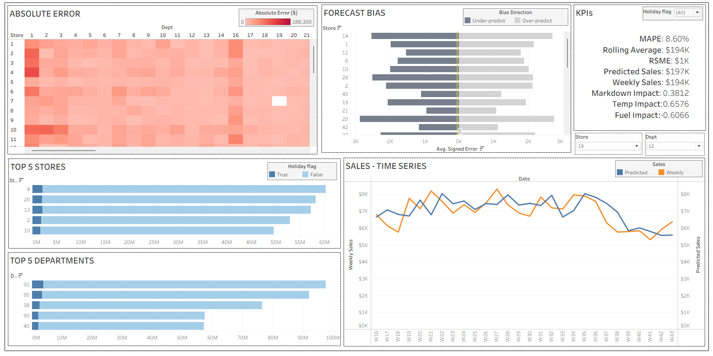

# 🏪 Walmart Sales Forecasting
**End-to-end retail demand forecasting using Random Forest ML and interactive Tableau dashboard.**

## 🎯 Project Overview

Built a machine learning solution to predict weekly sales for Walmart stores across different departments. Demonstrates complete data science pipeline from data preprocessing to business intelligence dashboard.

**Key Achievement:** Random Forest model with comprehensive error analysis and interactive Tableau dashboard for stakeholder decision-making.



## 🛠️ Tech Stack

- **ML**: Python, Random Forest, Scikit-learn
- **Data**: Pandas, NumPy  
- **Visualization**: Tableau, Matplotlib
- **Tools**: Jupyter Notebook

## 📊 Dataset & Results

- **Data**: 421K+ records, 45 stores, 99 departments (2010-2012)
- **Features**: Sales history, store metadata, promotions, weather, economic indicators
- **Model**: Random Forest with temporal features (lag, rolling averages)

### Key Features Created:

```
train['Lag_1'] = train.groupby(['Store', 'Dept'])['Weekly_Sales'].shift(1)
```

```
train['RollingMean_4'] = train.groupby(['Store', 'Dept'])['Weekly_Sales'].transform(
lambda x: x.shift(1).rolling(4).mean())
```

## 📈 Dashboard Features 

- **KPIs**: MAPE, RMSE, Predicted vs Actual Sales
- **Error Analysis**: Heatmap by Store × Department  
- **Bias Detection**: Over/under-prediction patterns
- **Interactive Filters**: Store, Department, Holiday periods
- **Time Series**: Actual vs predicted sales trends

## 🚀 Quick Start
```
git clone https://github.com/Abhishek24J/walmart-sales-forecasting.git
```
```
cd walmart-sales-forecasting
```
```
pip install -r requirements.txt
```
```
jupyter notebook notebooks/Walmart_Forecasting.ipynb
```

## 🔍 Key Insights

- **Temporal patterns**: Previous week sales + 4-week rolling averages are top predictors
- **Seasonal effects**: Clear holiday uplift captured effectively  
- **Store variability**: Forecast accuracy varies significantly across locations
- **External factors**: Temperature and fuel prices correlate with sales
